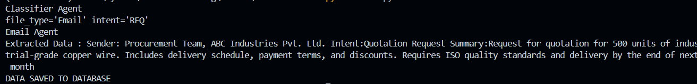
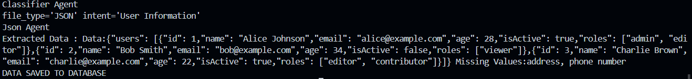
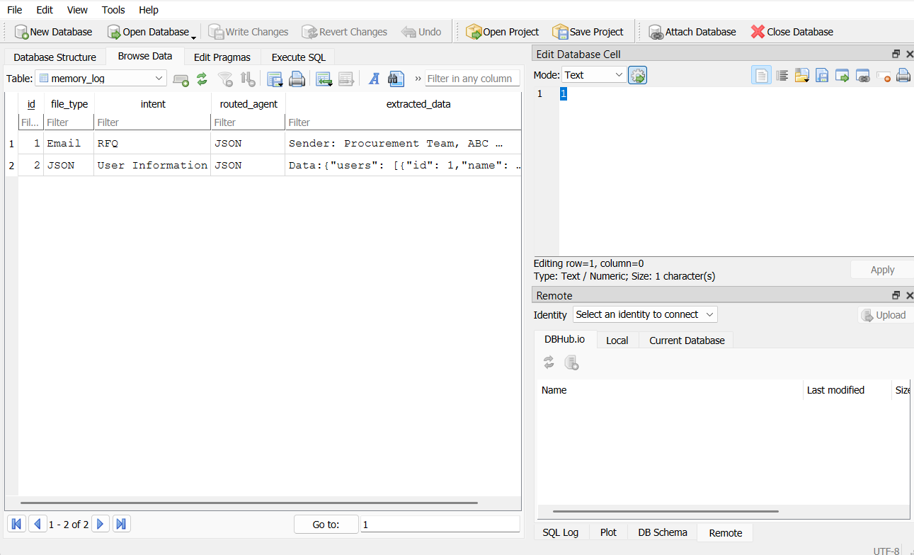

# SmartRoute-AI


## 📹 Demonstration Video

A video showcasing the working of SmartRoute-AI is available below:

[SmartRoute-AI Demonstration](https://drive.google.com/file/d/15mb5L1HkxFs9sC8KnpSYXKUAB7Pdx-yV/view?usp=sharing)

## 🧪 Sample Input
**Email Data**

```
Dear Vendor,

We would like to request a quotation for the supply of 500 units of industrial-grade copper wire. Please include the delivery schedule, payment terms, and any applicable discounts in your response. The products should meet ISO quality standards and be delivered by the end of next month.

Looking forward to your prompt response.

Best regards,  
Procurement Team  
ABC Industries Pvt. Ltd.

```

**JSON Data**

```{
  "users": [
    {
      "id": 1,
      "name": "Alice Johnson",
      "email": "alice@example.com",
      "age": 28,
      "isActive": true,
      "roles": ["admin", "editor"]
    },
    {
      "id": 2,
      "name": "Bob Smith",
      "email": "bob@example.com",
      "age": 34,
      "isActive": false,
      "roles": ["viewer"]
    },
    {
      "id": 3,
      "name": "Charlie Brown",
      "email": "charlie@example.com",
      "age": 22,
      "isActive": true,
      "roles": ["editor", "contributor"]
    }
  ]
}
```

## 📈 Output Log




## SQLite Database View



## 🛠️ Installation

1. **Clone the Repository:**

   ```bash
   git clone https://github.com/Rohit131313/SmartRoute-AI.git
   cd SmartRoute-AI
   ```


2. **Install Dependencies:**

   ```bash
   pip install -r requirements.txt
   ```

3. **Add Gemini Api in .env file**
    ```bash
    GOOGLE_API_KEY = ""
    ```


4. **Run the Application:**

   ```bash
   python main.py
   ```

